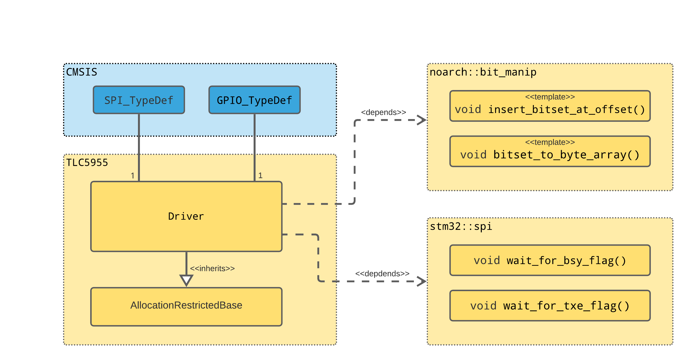

## TLC5955 48 Channel RGB LED driver library

TLC5955 datasheet can be found [here](https://www.ti.com/product/TLC5955)

See [LedManager](https://github.com/cracked-machine/StepSequencer_SW/blob/main/main_app/src/led_manager.cpp) for example of how to use this driver.

### Design

### Usage

[For example on how to use this class](https://godbolt.org/z/rx53GcrsE)

### Running Units Tests on X86

Running `cmake` in the root directory will invoke the tests.
It is recommended to use VSCode and "CMake Tools" extension with Test Suite, but if you insist on using the CLI:

- Configure the testsuite:
`cmake --no-warn-unused-cli -DCMAKE_EXPORT_COMPILE_COMMANDS:BOOL=TRUE -DCMAKE_BUILD_TYPE:STRING=Debug -DCMAKE_C_COMPILER:FILEPATH=/bin/x86_64-linux-gnu-gcc-10 -Bbuild -G Ninja .`
- Build the testsuite
`cmake --build build --config Debug --target all --`
- Run the testsuite
`./build/test_suite`
- Clean the testsuite
`cmake --build build --config Debug --target clean --`

### Adding this library to your STM32 Project

Include this repo into your project as a submodule and add the following line to your top-level CMakeFiles.txt:

`add_subdirectory(embedded_utils)`

This assumes your project's top-level CMakeFiles.txt is already configured for STM32 platform.

### Debug

`GDB` is enabled in VSCode (F5)

### Code Coverage report

Run the "coverage report" task. Results can be found in `coverage` directory.

